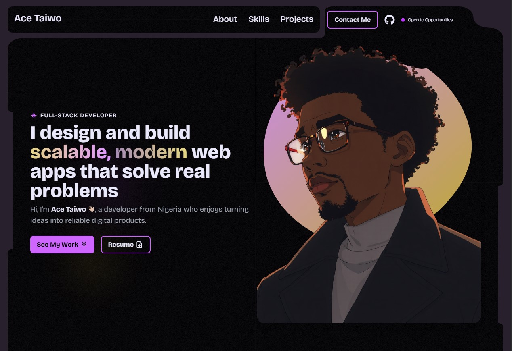

# 👋 Ace Taiwo – Personal Portfolio

Welcome to my personal portfolio! This site showcases my journey as a web developer, highlighting projects I've built, skills I've mastered, and my passion for creating intuitive and visually appealing web experiences.

🔗 **Website:** https://acetaiwo.com/  
📦 **Repository:** [*(this repo)*](https://github.com/Acehood455/live-portfolio/)

---

## ✨ Features

- 💻 Showcases fullstack and frontend projects
- 🎨 Modern UI/UX design with responsive layouts
- ⚡ Built with React, Vite, Tailwind CSS, and TypeScript
- 📊 Interactive project sections with live demos and GitHub links
- 📬 Easy contact and collaboration options

---

## 🛠️ Tech Stack

- **React** – Component-based UI development
- **Vite** – Fast build tool
- **Tailwind CSS** – Utility-first styling
- **TypeScript** – Type safety
- **Next.js** – Server-side rendering and routing
- **Framer Motion** – Animations & transitions
- **Supabase / Prisma / PostgreSQL** – Backend integration (for projects)

---

## 🚀 Getting Started

### 1. Clone the repository
```bash
git clone https://github.com/Acehood455/live-portfolio.git
cd portfolio
```
## 2. Install dependencies
```
npm install
```
## 3. Start the development server
```
npm run dev
```

## The app will run on:
👉 http://localhost:5173

---

## 📌 Purpose

- Showcase personal and professional web development projects
- Demonstrate skills in frontend, fullstack, and modern web technologies
- Provide a platform for collaboration and portfolio presentation

---



---

## 🙌 Acknowledgements

- Built with inspiration from modern portfolio designs
- Projects and code developed as part of personal growth and learning

## 📬 Contact

Feel free to reach out for collaboration, feedback, or opportunities:

Ace Taiwo

Frontend / Fullstack Developer

Email: hey@acetaiwo.com

LinkedIn: [LinkedIn profile](https://linkedin.com/in/ace-taiwo-046a6b384)

X: [X handle](https://x.com/acetaiwo)
